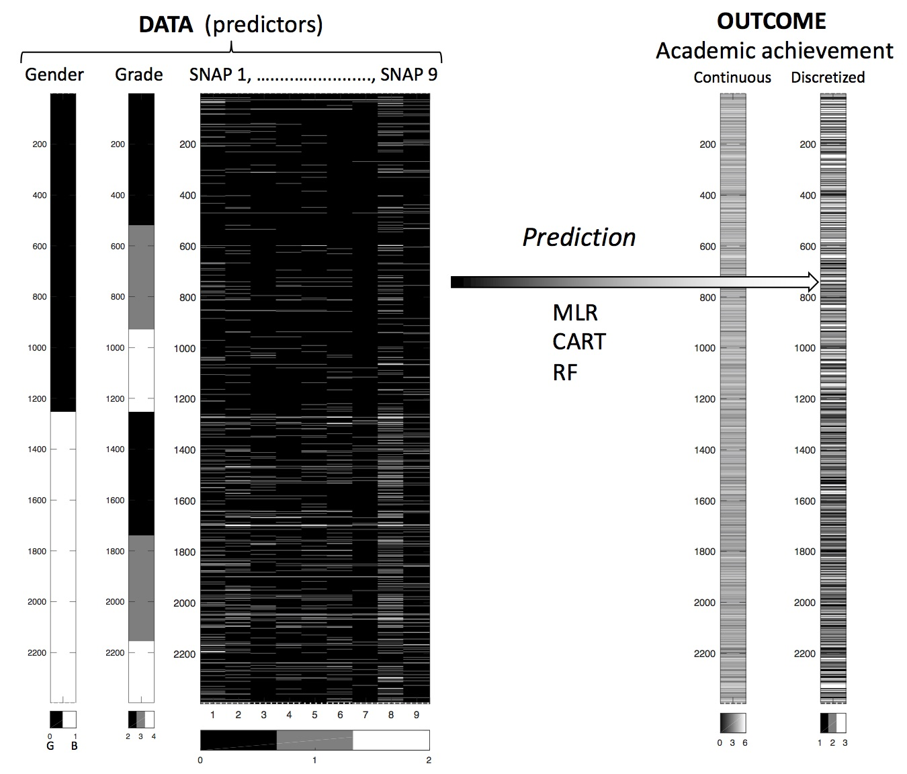

# inattention-populationsample
Prediction of academic achievement in adolescents from teacher reports of inattention in childhood - a methodological pattern classification study (AJL, TB, AL)

<small>
This is an [R Markdown](http://rmarkdown.rstudio.com) [Notebook](http://rmarkdown.rstudio.com/r_notebooks.html). 
When you execute code within the notebook, the results appear beneath the code. 
Try executing this chunk by clicking the *Run* button within the chunk or by placing your cursor inside it and pressing *Cmd+Shift+Enter*. 
Add a new chunk by clicking the *Insert Chunk* button on the toolbar or by pressing *Cmd+Option+I*.
When you save the notebook, an HTML file containing the code and output will be saved alongside it (click the *Preview* button or press *Cmd+Shift+K* to preview the HTML file).
</small>

## Abstract

### Background
Inattentive behavior is associated with academic problems. The present study investigates primary school teacher reports on nine items reflecting different aspects of inattention, with an aim to reveal patterns of behavior predicting high-school academic achievement. To that end, we used different types of pattern analysis and machine learning methods. 

### Methods
Inattention in a sample 2397 individuals were rated by their primary school teachers when they participated in the first wave of the Bergen Child Study (BCS) (7 - 9 years old), and their academic achievements were available from an official school register when attending high-school (16 - 19 years old). Inattention was assessed by the nine items rated at a categorical leve, and the academic achievement scores were divided into three parts including a similar number of participants. 

### Results 
Boys obtained higher inattention scores and lower academic scores than girls. Inattention problems related to sustained attention and distractibility turned out to have the highest predictive value of academic achievement level across all selected statistical analyses, and the full model showed that inattention explained about 10\% of the variance in high school scores about 10 years later. A high odds-ration of being allocated to the lowest academic achievement category was shown by a multinominal regression analysis, while a pattern of problems related to sustained attention and distractibility was revealed by generating classification trees. By including recursive learning algorithms, the most successful classification was found between these inattention items and the highest level of achievement scores. 

### Summary 
The present study showed the importance of a pattern of early problems related to sustained attention and distractibility in predicting future academic results. By including different statistical classification models we showed that this pattern was fairly consistent. Furthermore, calculation of classification errors gave information about the uncertainty when predicting the outcome for individual children. Further studies should include a wider range of variables. 

<small>Organization of the data and the analysis:</small>

Libraries being used:

* memisc - spss.system.file()
* psych  - headTail(), describe()
* Hmisc - describe()
* pander - pander(), panderOptions()

### Data preparation

Code:
 * inattention-populationsample-data-prep.Rmd
 
Input file:

 * inattention_Arvid_new.sav (from Astri, on ~/Dropbox/Arvid_inattention/data2)
 * Alternatively: D <- read.csv(file = "../data/inattention_nomiss_2397x12.csv")
 
Output files (data):

 * inattention_nomiss_2397x12.csv
 * inattention_nomiss_2397x12_snap_is_0_1_2.csv
 * inattention_nomiss_2397x12_snap_is_0_1.csv
 * inattention_nomiss_2397x12_snap_is_0_1_2_outcome_is_L_M_H.csv (Low, Medium, High academic score)
 * inattention_nomiss_2397x12_snap_is_0_1_2_outcome_is_0_1_2.csv (all numerical)
 * inattention_nomiss_2397x12_snap_is_N_S_C_outcome_is_L_M_H.csv (Not, Somewhat, Certainly true)
 
