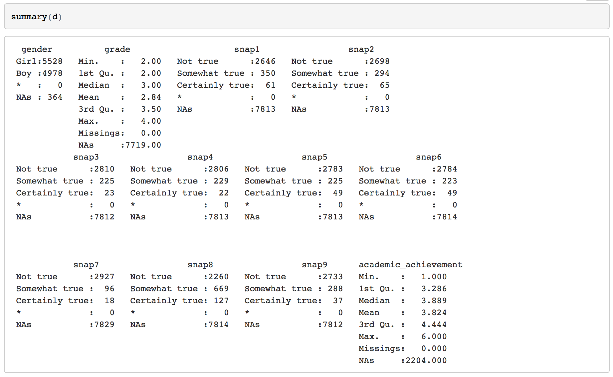

```{r, echo=TRUE, eval=FALSE}
~GitHub/inattention-populationsample/code/inattention-populationsample-data-prep.Rmd
```
<small>
This is an [R Markdown](http://rmarkdown.rstudio.com) Notebook. When you execute code within the notebook, the results appear beneath the code. 
Try executing this chunk by clicking the *Run* button within the chunk or by placing your cursor inside it and pressing *Cmd+Shift+Enter*. 
Add a new chunk by clicking the *Insert Chunk* button on the toolbar or by pressing *Cmd+Option+I*.
When you save the notebook, an HTML file containing the code and output will be saved alongside it (click the *Preview* button or press *Cmd+Shift+K* to preview the HTML file).
</small>


<small>Organization of the data and the analysis:</small>


### Data preparation

Input file:

 * inattention_Arvid_new.sav (from Astri, on ~/Dropbox/Arvid_inattention/data2)
 * inattention_Astri_94_96_new_grades_updated.sav (on ~/Dropbox/Arvid_inattention/data2) [Correct age]
 * Alternatively: D <- read.csv(file = "../data/inattention_nomiss_2397x12.csv")
 
Output files (data):

 * inattention_nomiss_2397x12.csv
 * inattention_nomiss_2397x12_snap_is_0_1_2.csv
 * inattention_nomiss_2397x12_snap_is_0_1.csv
 * inattention_nomiss_2397x12_snap_is_0_1_2_outcome_is_L_M_H.csv (Low, Medium, High academic score)
 * inattention_nomiss_2397x12_snap_is_0_1_2_outcome_is_0_1_2.csv (all numerical)
 * inattention_nomiss_2397x12_snap_is_N_S_C_outcome_is_L_M_H.csv (Not, Somewhat, Certainly true)
 

```{r, echo=TRUE, eval=FALSE} 
 # D <- read.csv(file = "../data/inattention_nomiss_2397x12.csv")
```


```{r, echo=TRUE, eval=TRUE}
# The original SPSS file as provided to AJL is
# 'inattention_Astri_94_96_new_grades_updated.sav'
# and being edited and reduced by AJL to 'inattention_Arvid_new.sav'
# Import data stored in the SPSS format
library(memisc)
# fn <- "../data/inattention_Arvid_new.sav"
fn <- "/Users/arvid/Dropbox/Arvid_inattention/data2/inattention_Arvid_new.sav"
data <- as.data.set(spss.system.file(fn))

library(foreign)
fn_age <- "/Users/arvid/Dropbox/Arvid_inattention/data2/inattention_Astri_94_96_new_grades_updated.sav"
Sys.getlocale()
#Sys.setlocale(locale="C")
data_age <- read.spss(fn_age, to.data.frame=TRUE, use.value.labels=FALSE)
#names(data_age)
dim(data_age)
age_c4 = data_age$c_4_age_at_completion 
summary(age_c4)

# Make new data frame from the sample with the variables 
# gender, grade, SNAP1, ..., SNAP9 (vars #1-11) and
# academic_achievement (var #52) 
names(data)
d <- data[, c(1:11, 52)]
dim(d)
names(d)
str(d)
summary(d)
dd <- d
dd$age <- age_c4
summary(dd)
```



```{r, echo=TRUE, eval=TRUE}
# Get observations of data frame that have missing values and those with complete cases
library(psych)
d.miss <- d[!complete.cases(d),]
d.nomiss <- d[complete.cases(d),]
str(d.nomiss)
headTail(as.data.frame(d.nomiss))
summary(d.nomiss)
D1 <- d.nomiss   # For later use
dd.nomiss <- dd[complete.cases(dd),]
summary(dd.nomiss)
```

#### For the manuscript

```{r, echo=TRUE, eval=TRUE}
ss = summary(D1$gender)
```

##### Running a t-test regarding age and gender 
```{r, echo=TRUE, eval=TRUE}
tt <- with(subset(dd.nomiss, gender %in% c("Girl", "Boy")),
     t.test(age ~ factor(gender)))
tt
```    

.. and information about gender and academic achievement when they participated in the fourth study wave - in total `r nrow(D1)` participants, `r ss[[1]]` `r names(ss[1])`s and `r ss[[2]]` `r names(ss[2])`s.
Mean age when included in wave 4 was `r mean(dd.nomiss$age)` (16.95) years  and SD `r sd(dd.nomiss$age)` (SD = .846), with a slightly higher mean age in girls compared to boys (p=`r tt$p.value`) 

nonsignificant age-difference between girls and boys (p = .088).


### ! Make a table of SNAP1-9 distribution according to Not true (N), Somewhat true (S),  Certainly true (C) for boys and girls separately

```{r, echo=TRUE, eval=TRUE}
summary(D1$snap1[D1$gender == "Boy"])
```

```{r, echo=TRUE, eval=TRUE}
summary(D1$snap1[D1$gender == "Girl"])
```

```{r, echo=TRUE, eval=TRUE}
# Association Statistics
# Computes the Pearson chi-Squared test, the Likelihood Ratio chi-Squared test, 
# the phi coefficient, the contingency coefficient and Cramer's V for possibly 
# stratified contingency tables.
library(vcd)

tab <- xtabs(~gender + grade, data = D1)
summary(assocstats(tab))
```


```{r, echo=TRUE, eval=TRUE}
# Save the nomiss D to an .csv file without row names for further analysis
D <- d.nomiss
write.csv(D, file = "../data/inattention_nomiss_2397x12.csv",row.names=FALSE)
```


```{r, echo=TRUE, eval=TRUE}
# For simplicity, we rename (and translate) the variables names in the dataset D without any missing
library(plyr)
d.nomiss <- read.csv(file = "../data/inattention_nomiss_2397x12.csv")
D <- d.nomiss
D <- rename(D, c(academic_achievement="ave"))
D$ave <- as.numeric(D$ave)
D$snap1 <- mapvalues(as.factor(D$snap1), from = c("Not true","Somewhat true","Certainly true"), to = c("0","1","2"))
D$snap1 <- as.numeric(D$snap1)-1
D$snap2 <- mapvalues(as.factor(D$snap2), from = c("Not true","Somewhat true","Certainly true"), to = c("0","1","2"))
D$snap2 <- as.numeric(D$snap2)-1
D$snap3 <- mapvalues(as.factor(D$snap3), from = c("Not true","Somewhat true","Certainly true"), to = c("0","1","2"))
D$snap3 <- as.numeric(D$snap3)-1
D$snap4 <- mapvalues(as.factor(D$snap4), from = c("Not true","Somewhat true","Certainly true"), to = c("0","1","2"))
D$snap4 <- as.numeric(D$snap4)-1
D$snap5 <- mapvalues(as.factor(D$snap5), from = c("Not true","Somewhat true","Certainly true"), to = c("0","1","2"))
D$snap5 <- as.numeric(D$snap5)-1
D$snap6 <- mapvalues(as.factor(D$snap6), from = c("Not true","Somewhat true","Certainly true"), to = c("0","1","2"))
D$snap6 <- as.numeric(D$snap6)-1
D$snap7 <- mapvalues(as.factor(D$snap7), from = c("Not true","Somewhat true","Certainly true"), to = c("0","1","2"))
D$snap7 <- as.numeric(D$snap7)-1
D$snap8 <- mapvalues(as.factor(D$snap8), from = c("Not true","Somewhat true","Certainly true"), to = c("0","1","2"))
D$snap8 <- as.numeric(D$snap8)-1
D$snap9 <- mapvalues(as.factor(D$snap9), from = c("Not true","Somewhat true","Certainly true"), to = c("0","1","2"))
D$snap9 <- as.numeric(D$snap9)-1
D$gender <- mapvalues(as.factor(D$gender), from = c("Girl", "Boy"), to = c("0", "1"))
D$gender <- as.numeric(D$gender)-1
D$grade <- as.numeric(D$grade)
str(D)
headTail(D)
D3 <- D   # For later use
```

```{r, echo=TRUE, eval=TRUE}
# Save D (at early stage) to an .csv file for later analysis in R or MATLAB 
write.csv(D, file = "../data/inattention_nomiss_2397x12_snap_is_0_1_2.csv",row.names=FALSE)
```

```{r, echo=TRUE, eval=TRUE}
# For even more simplicity, we rename (and translate) the variables names in the dataset 
# without any missing, reducing the predictor categories to be binary, 
# i.e. collapsing SNAP values "1" and "2" to "1":
library(plyr)
D <- d.nomiss
D <- rename(D, c(academic_achievement="ave"))
D$ave <- as.numeric(D$ave)
D$snap1 <- mapvalues(as.factor(D$snap1), from = c("Not true","Somewhat true","Certainly true"), to = c("0","1","1"))
D$snap1 <- as.numeric(D$snap1)-1
D$snap2 <- mapvalues(as.factor(D$snap2), from = c("Not true","Somewhat true","Certainly true"), to = c("0","1","1"))
D$snap2 <- as.numeric(D$snap2)-1
D$snap3 <- mapvalues(as.factor(D$snap3), from = c("Not true","Somewhat true","Certainly true"), to = c("0","1","1"))
D$snap3 <- as.numeric(D$snap3)-1
D$snap4 <- mapvalues(as.factor(D$snap4), from = c("Not true","Somewhat true","Certainly true"), to = c("0","1","1"))
D$snap4 <- as.numeric(D$snap4)-1
D$snap5 <- mapvalues(as.factor(D$snap5), from = c("Not true","Somewhat true","Certainly true"), to = c("0","1","1"))
D$snap5 <- as.numeric(D$snap5)-1
D$snap6 <- mapvalues(as.factor(D$snap6), from = c("Not true","Somewhat true","Certainly true"), to = c("0","1","1"))
D$snap6 <- as.numeric(D$snap6)-1
D$snap7 <- mapvalues(as.factor(D$snap7), from = c("Not true","Somewhat true","Certainly true"), to = c("0","1","1"))
D$snap7 <- as.numeric(D$snap7)-1
D$snap8 <- mapvalues(as.factor(D$snap8), from = c("Not true","Somewhat true","Certainly true"), to = c("0","1","1"))
D$snap8 <- as.numeric(D$snap8)-1
D$snap9 <- mapvalues(as.factor(D$snap9), from = c("Not true","Somewhat true","Certainly true"), to = c("0","1","1"))
D$snap9 <- as.numeric(D$snap9)-1
D$gender <- mapvalues(as.factor(D$gender), from = c("Girl", "Boy"), to = c("0", "1"))
D$gender <- as.numeric(D$gender)-1
D$grade <- as.numeric(D$grade)
str(D)
headTail(D)
D2 <- D  # For later use
```

```{r, echo=TRUE, eval=TRUE}
# Save the new D to an .csv file without row names for further analysis
write.csv(D, file = "../data/inattention_nomiss_2397x12_snap_is_0_1.csv",row.names=FALSE)
```


#### Struture of the D dataset

```{r fig.width=9, fig.height=4}
D <- D3
s <- dim(D)
n <- s[1]
p <- s[2]
txt = sprintf("Structure of the %d x %d DATASET", n, p)
print(txt)

library(DiagrammeR)

n_txt = sprintf("Dataset \n (N = %d)", n);
gviz <- grViz("
              # Circles: predictor variables; Triangle: Outcome variable

              digraph Structure_of_the_dataset_D {

              # node definitions with substituted label text
              node [fontname = Helvetica]
              1 [label = 'Dataset \n (N = 2397)', shape=box]
              2 [label = 'gender \n {Girl (0) | Boy (1)}', shape=circle]
              3 [label = 'grade \n {2 | 3 | 4}', shape=circle]
              4 [label = 'ave \n (average marks) \n [1, 6] or {low (L) | medium (M) | high (H)}', shape=triangle]
              a [label = 'SNAP \n {0 | 1 | 2}', shape=oval]
              b [label = 'SNAP1', shape=circle]
              c [label = 'SNAP2', shape=circle]
              d [label = 'SNAP3', shape=circle]
              e [label = 'SNAP4', shape=circle]
              f [label = 'SNAP5', shape=circle]
              g [label = 'SNAP6', shape=circle]
              h [label = 'SNAP7', shape=circle]
              i [label = 'SNAP8', shape=circle]
              j [label = 'SNAP9', shape=circle]

              # edge definitions with the node IDs
              1 -> {2 3 a 4}
              a -> {b c d e f g h i j}
              }",
engine = "dot")

print(gviz)

# This does not work using DiagrammeR / GraphViz
# png("../manuscript/Figs/graph_design.png")
# print(gviz)
# dev.off()
# Uses Viewer, Zoom and Screen capture to produce .png and then
# data_prep_structure_grviz_20160203.pdf file
```

#### The dataset that will be analyzed and reported

In our analysis we included n = `r nrow(D)` individuals (none with missing data) from 
the dataset "`r fn`". 

```{r, echo=TRUE, eval=TRUE}
D <- D3
n_txt = sprintf("In our analysis we included n = %d individuals (none with missing data) from the dataset '%s'\n", nrow(D), fn);
print(n_txt)
```


#### Grades (continuous and categorized)

We consider the grades (academic_achievement), as both a continuous (for regression) and 
discretized variable (for classification), where
*gjennomsnitt*: - Item 'Karaktergjennomsnitt alle gyldige karakterer 1-6 (ikke kroppsøving)' 

```{r, echo=TRUE, eval=TRUE}
# Discretized at three levels, with data-driven cutpoints (equifrequent levels)
D <- D3
aver <- D$ave
summary(aver)
bins <- 3
cutpoints<-quantile(aver,(0:bins)/bins,names=FALSE)
print(cutpoints)

# Consistent with MATLAB 'histcounts' (D_20151110_analysis.m  ;  T2)
# fn2 = '../data/D_20151110.csv';
# T2 = readtable(fn2);
# bins = 3;
# y = quantile(T2.ave,[0:bins]/bins)
# [N,EDGES,BIN] = histcounts(T2.ave,y);
# cuts = sprintf('1:[%.2f, %.2f) 2:[%.2f,%.2f) 3:[%.2f,%.2f]', EDGES(1), EDGES(2), EDGES(2), EDGES(3), EDGES(3), EDGES(4));
# T2.ave_cat = BIN;   % categorical(BIN,'Ordinal',true);
# descr = sprintf('%s - 1:low, 2:medium; 3:high average mark', cuts);
# T2.Properties.VariableDescriptions{'ave_cat'} = descr;
# => descr = 1:[1.00, 3.75) 2:[3.75,4.43) 3:[4.43,5.90] - 1:low, 2:medium; 3:high average mark
```
```{r, echo=TRUE, eval=TRUE}
averBinned <- cut(aver, cutpoints, right=FALSE, include.lowest=TRUE)
summary(averBinned)
```

Make histogram of dicretized 'averBinned':
```{r, echo=TRUE, eval=TRUE}
hist(as.numeric(averBinned))
```

Define *grade categories* "low", "medium" and "high" in terms of the calculated cut-point intervals:

```{r, echo=TRUE, eval=TRUE}
txt_low <- sprintf("low (L): [%.3f, %.3f)\n", cutpoints[[1]], cutpoints[[2]])
print(txt_low)
txt_medium <- sprintf("medium (M): [%.3f, %.3f)\n", cutpoints[[2]], cutpoints[[3]])
print(txt_medium)
txt_high <- sprintf("high H): [%.3f, %.3f]\n", cutpoints[[3]], cutpoints[[4]])
print(txt_high)
```

```{r, echo=TRUE, eval=TRUE}
library(psych)
# Dataset for classification based on D3 and discretized average academic achievemnt
C <- D3
C$averBinned <- cut(aver, cutpoints, right=FALSE, include.lowest=TRUE,
                     labels=c("L","M","H"))
C <- subset(C, select = -c(ave))
str(C)
headTail(as.data.frame(C))
headTail(as.data.frame(D3))
```

```{r, echo=TRUE, eval=TRUE}
# Save the dataset C with binary SNAP predictors and trinary outcome to an .csv file 
# for further analysis
write.csv(C, file = "../data/inattention_nomiss_2397x12_snap_is_0_1_2_outcome_is_L_M_H.csv",row.names=FALSE)
```

```{r, echo=TRUE, eval=TRUE}
# Dataset for classification based on D3 and discretized average academic achievemnt
E <- D3
E$averBinned <- cut(aver, cutpoints, right=FALSE, include.lowest=TRUE,
                     labels=c("0","1","2"))
E <- subset(E, select = -c(ave))
str(E)
summary(E)
headTail(as.data.frame(E))
headTail(as.data.frame(D3))
```

```{r, echo=TRUE, eval=TRUE}
# Save the dataset E with numerical SNAP predictors and trinary outcome to an .csv file 
# for further analysis
write.csv(E, file = "../data/inattention_nomiss_2397x12_snap_is_0_1_2_outcome_is_0_1_2.csv",row.names=FALSE)
```

#### Converting numerical variables to factors

```{r, echo=TRUE, eval=TRUE}
library(xtable)
C <- as.data.frame(C)
# select columns
cols <- c("gender", "grade", "snap1", "snap2", "snap3", "snap4", "snap5", "snap6", "snap7", "snap8", "snap9", "averBinned")
C[,cols] <- data.frame(apply(C[cols], 2, as.factor))

levels(C$gender) <- c("G", "B")
levels(C$grade) <- c("2nd", "3rd", "4th")
# N - not true (0)
# S - somewhat true (1)
# C - certainly true (2)
levels(C$snap1) <- c("N", "S", "C")  
levels(C$snap2) <- c("N", "S", "C")  
levels(C$snap3) <- c("N", "S", "C")  
levels(C$snap4) <- c("N", "S", "C")  
levels(C$snap5) <- c("N", "S", "C")  
levels(C$snap6) <- c("N", "S", "C")  
levels(C$snap7) <- c("N", "S", "C")  
levels(C$snap8) <- c("N", "S", "C")  
levels(C$snap9) <- c("N", "S", "C")
levels(C$averBinned) <- c("H", "L", "M")    # numerical order = alphabetical order
str(C)
headTail(C)
summary(C)
xtable(summary(C))
```

```{r, echo=TRUE, eval=TRUE}
# Save the dataset C with SNAP predictors as factors and trinary outcome to an .csv file 
# for further analysis
write.csv(C, file = "../data/inattention_nomiss_2397x12_snap_is_N_S_C_outcome_is_L_M_H.csv",row.names=FALSE)
```

```{r, echo=TRUE, eval=TRUE}
library(Hmisc)
describe(C)
```

```{r, echo=TRUE, eval=TRUE}
library(pander)
panderOptions("digits", 5)
pander(summary(C))
pander(summary(E))
```


Describe subsets of data according to academic achievement and gender

```{r, echo=TRUE, eval=TRUE}
C.girls.L <- C[ which(C$gender=='G' & C$averBinned=='L'), ]
C.girls.H <- C[ which(C$gender=='G' & C$averBinned=='H'), ]
C.boys.L <- C[ which(C$gender=='B' & C$averBinned=='L'), ]
C.boys.H <- C[ which(C$gender=='B' & C$averBinned=='H'), ]
summary(C.girls.L)
summary(C.girls.H)
summary(C.boys.L)
summary(C.boys.H)
library(Hmisc)
describe(C.girls.L)
describe(C.girls.H)
describe(C.boys.L)
describe(C.boys.H)
```
