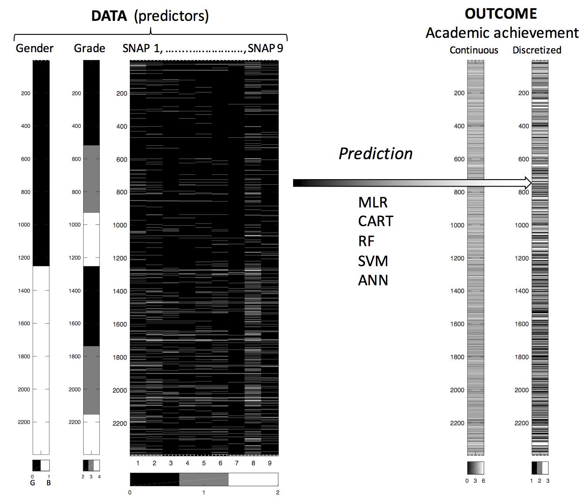

```{r, echo=TRUE, eval=FALSE}
~GitHub/inattention-population/code/inattention-populationsample-rf.Rmd
```

<small>
This is an [R Markdown](http://rmarkdown.rstudio.com) Notebook. When you execute code within the notebook, the results appear beneath the code. 
Try executing this chunk by clicking the *Run* button within the chunk or by placing your cursor inside it and pressing *Cmd+Shift+Enter*. 
Add a new chunk by clicking the *Insert Chunk* button on the toolbar or by pressing *Cmd+Option+I*.
When you save the notebook, an HTML file containing the code and output will be saved alongside it (click the *Preview* button or press *Cmd+Shift+K* to preview the HTML file).
</small>


## Abstract

### Background
Inattentive behavior is associated with academic problems. The present study investigates primary school teacher reports on nine items reflecting different aspects of inattention, with an aim to reveal patterns of behavior predicting high-school academic achievement. To that end, we used different types of pattern analysis and machine learning methods. 

### Methods
Inattention in a sample 2397 individuals were rated by their primary school teachers when they participated in the first wave of the Bergen Child Study (BCS) (7 - 9 years old), and their academic achievements were available from an official school register when attending high-school (16 - 19 years old). Inattention was assessed by the nine items rated at a categorical leve, and the academic achievement scores were divided into three parts including a similar number of participants. 

### Results 
Boys obtained higher inattention scores and lower academic scores than girls. Inattention problems related to sustained attention and distractibility turned out to have the highest predictive value of academic achievement level across all selected statistical analyses, and the full model showed that inattention explained about 10\% of the variance in high school scores about 10 years later. A high odds-ration of being allocated to the lowest academic achievement category was shown by a multinominal regression analysis, while a pattern of problems related to sustained attention and distractibility was revealed by generating classification trees. By including recursive learning algorithms, the most successful classification was found between these inattention items and the highest level of achievement scores. 

### Summary 
The present study showed the importance of a pattern of early problems related to sustained attention and distractibility in predicting future academic results. By including different statistical classification models we showed that this pattern was fairly consistent. Furthermore, calculation of classification errors gave information about the uncertainty when predicting the outcome for individual children. Further studies should include a wider range of variables. 


<small>Organization of the data and the analysis:</small>

Libraries being used:

* memisc - spss.system.file()
* psych  - headTail(), describe()
* Hmisc - describe()
* pander - pander(), panderOptions()



### Data preparation

Input file:

 * inattention_Arvid_new.sav (from Astri, on ~/Dropbox/Arvid_inatteion/data2)
 * inattention_nomiss_2397x12.csv
 
Output files (data):

 * inattention_nomiss_2397x12_snap_is_0_1_2.csv
 * inattention_nomiss_2397x12_snap_is_0_1.csv
 * inattention_nomiss_2397x12_snap_is_0_1_2_outcome_is_L_M_H.csv (Low, Medium, High academic score)
 * inattention_nomiss_2397x12_snap_is_0_1_2_outcome_is_0_1_2.csv (all numerical)
 * inattention_nomiss_2397x12_snap_is_N_S_C_outcome_is_L_M_H.csv (Not, Somewhat, Certainly true)
 

```{r, echo=TRUE, eval=TRUE} 
fn <- "../data2/inattention_Arvid_new.sav"
```

```{r, echo=TRUE, eval=FALSE}
# The original SPSS file as provided to AJL is
# 'inattention_Astri_94_96_new_grades_updated.sav'
# and being edited and reduced by AJL to 'inattention_Arvid_new.sav'
# Import data stored in the SPSS format
library(memisc)
fn <- "../data2/inattention_Arvid_new.sav"
data <- as.data.set(spss.system.file(fn))

# Make new data frame from the sample with the variables 
# gender, grade, SNAP1, ..., SNAP9 (vars #1-11) and
# academic_achievement (var #52) 
names(data)
d <- data[, c(1:11, 52)]
dim(d)
names(d)
str(d)
summary(d)
```

```{r, echo=TRUE, eval=TRUE}
D3 <- read.csv(file = "../data/inattention_nomiss_2397x12_snap_is_0_1_2.csv") 
C <- read.csv(file = "../data/inattention_nomiss_2397x12_snap_is_0_1_2_outcome_is_L_M_H.csv")
D <- read.csv(file = "../data/inattention_nomiss_2397x12_snap_is_N_S_C_outcome_is_L_M_H.csv")
E <- read.csv(file = "../data/inattention_nomiss_2397x12_snap_is_0_1_2_outcome_is_0_1_2.csv")
str(D3)
head(D3)
str(C)
head(C)
str(D)
head(D)
str(E)
head(E)
```


### Random Forest for SNAP inattention data 

Random forests are very good in that it is an ensemble learning method used for classification and regression.  It uses multiple models for better performance that just using a single tree model.  In addition because many sample are selected in the process a measure of variable importance can be obtain and this approach can be used for model selection and can be particularly useful when forward/backward stepwise selection is not appropriate and when working with an extremely high number of candidate variables that need to be reduced.

    
```{r, echo=TRUE, eval=TRUE}
library(randomForest)
E$averBinnedF = as.factor(E$averBinned)  # To perform clasification and not regression
E <- subset(E, select = -c(averBinned))
frmla = averBinnedF ~ gender + grade + snap1 + snap2 + snap3 + 
    snap4 + snap5 + snap6 + snap7 + snap8 + snap9
fit.Erf = randomForest(frmla, data=E)
print(fit.Erf)
plot(fit.Erf)
```

#### Extract variable importance measure:

Here are the definitions of the variable importance measures. The first measure is computed from permuting OOB data: For each tree, the prediction error on the out-of-bag portion of the data is recorded (error rate for classification, MSE for regression). Then the same is done after permuting each predictor variable. The difference between the two are then averaged over all trees, and normalized by the standard deviation of the differences. If the standard deviation of the differences is equal to 0 for a variable, the division is not done (but the average is almost always equal to 0 in that case).

The second measure is the total decrease in node impurities from splitting on the variable, averaged over all trees. For classification, the node impurity is measured by the Gini index. For regression, it is measured by residual sum of squares.

The function being plotted in Partial dependence plot *partialPlot* is defined as:

$$ \tilde{f}(x) = \frac{1}{n} ∑_{i=1}^n f(x, x_{iC}), $$

where $x$ is the variable for which partial dependence is sought, and $x_{iC}$ is the other variables in the data. The summand is the predicted regression function for regression, and logits (i.e., log of fraction of votes) for which.class for classification:

$$ f(x) = \log p_k(x) - \frac{1}{K} ∑_{j=1}^K \log p_j(x), $$

where $K$ is the number of classes, $k$ is which.class, and $p_j$ is the proportion of votes for class $j$.


```{r, echo=TRUE, eval=TRUE}
importance(fit.Erf)
plot(importance(fit.Erf), lty=2, pch=16)
lines(importance(fit.Erf))
varImpPlot(fit.Erf)
```


#### CORElearn:

This is a great package that contain many different machine learning algorithms and functions.  It include trees, forests, naive Bayes, locally weighted regression, among others.

Builds a classification or regression model from the data and formula with given parameters. Classification models available are

 * random forests, possibly with local weighing of basic models (parallel execution on several cores),

 * decision tree with constructive induction in the inner nodes and/or models in the leaves,

* kNN and weighted kNN with Gaussian kernel,

 * naive Bayesian classifier.

Regression models:

 * regression trees with constructive induction in the inner nodes and/or models in the leaves,

 * linear models with pruning techniques,

 * locally weighted regression,

 * kNN and weighted kNN with Gaussian kernel.


```{r, echo=TRUE, eval=TRUE}
library(CORElearn)
## Random Forests
frmla = averBinnedF ~ gender + grade + snap1 + snap2 + snap3 + 
    snap4 + snap5 + snap6 + snap7 + snap8 + snap9
fit.E.rand.forest = CoreModel(frmla, data=E, model="rf", selectionEstimator="MDL", minNodeWeightRF=5, rfNoTrees=500)
print(fit.E.rand.forest)
plot(fit.E.rand.forest)
```

<!-- regular html comment

```{r, echo=TRUE, eval=TRUE}
## decision tree with naive Bayes in the leaves
fit.E.dt = CoreModel(frmla, E, model="tree", modelType=4)
plot(fit.E.dt, E)
```

--> 

### Using the CARET package


The caret package (short for classification and regression training) contains functions to
streamline the model training process for complex regression and classification problems.
The package utilizes a number of R packages but tries not to load them all at package
start-up. The package “suggests” field includes 27 packages. caret loads packages as
needed and assumes that they are installed.

```{r, echo=TRUE, eval=TRUE}
library(caret)

# Feature density plots
library(AppliedPredictiveModeling)
transparentTheme(trans = 0.4)

featurePlot(x = E[, 1:11],
            y = E$averBinnedF,
            plot = "density",
            scales = list(x = list(relation="free"),
                          y = list(relation="free")),
            pch = "|",
            adjust = 1.5,
            layout = c(4,3),
            ## Add a key at the top
            auto.key = list(columns = 2))
```

```{r, echo=TRUE, eval=TRUE}
# Functions and Datasets from J. Fox and S. Weisberg, An R Companion to Applied Regression,
# Second Edition, Sage, 2011.
library(car)

# Keep 75 (70) % of the observations for training the classifier, 
# and 25 (30) % of the sample for performance evaluation (e.g. confusion matrix)
set.seed(998)
trainIndex <- createDataPartition(E$averBinnedF, p=.75, list=F)
# trainIndex <- createDataPartition(data$class, p=.70, list=F)
E.train <- E[trainIndex, ]
E.test <- E[-trainIndex, ]

# Check the random sample used for training
head(trainIndex)
```


Train the RF or ANN model on the training set (caret package)
check: to http://cran.r-project.org/web/packages/nnet/nnet.pdf, and
http://topepo.github.io/caret/training.html
The function train() sets up a grid of tuning parameters for a number of
classification and regression routines, fits each model and calculates
a resampling based performance measure.
method - a string specifying which classification or regression model to use
see http://topepo.github.io/caret/bytag.html
and https://www.byclb.com/TR/Tutorials/neural_networks/ch10_1.htm !!

```{r, echo=TRUE, eval=TRUE}
# The function trainControl can be used to specifiy the type of resampling in the training set
fitControl <- trainControl(   ## 10-fold CV [cross validation]
  method = "repeatedcv",
  number = 10,
  ## repeated ten times
  repeats = 10)

# Preprocessing (normalization) of training data
# Check: https://github.com/topepo/caret/issues/160
pp.E.train <- preProcess(E.train, method = c("center", "scale"))
pp.E.train <- predict.preProcess(pp.E.train, E.train)
# Preprocessing (normalization) of test data
pp.E.test <- preProcess(E.test, method = c("center", "scale"))
pp.E.test <- predict.preProcess(pp.E.test, E.test)
head(pp.E.train)
head(E.train)
head(pp.E.test)
head(E.test)
```

```{r, echo=TRUE, eval=TRUE}
# Random Forest classifier  cf. help(randomForest)
# method = 'rf'
# Type: Classification, Regression
# Tuning Parameters: mtry (number of variables randomly sampled as candidates at each split)

# For these caret models, train can automatically create a grid of tuning parameters.
# By default, if p is the number of tuning parameters, the grid size is 3^p.
# For rf we explore mtry
my.rf.grid <- expand.grid(.mtry = c(1, 2, 3))

E.rf.fit <- train(averBinnedF ~ . , data = E.train,
                       method = "rf",
                       maxit = 1000,
                       trControl = fitControl,
                       tuneGrid = my.rf.grid,
                       trace = FALSE)

print(E.rf.fit$finalModel$problemType)
print(E.rf.fit$finalModel$n)
print(E.rf.fit$finalModel$call)
print(E.rf.fit$finalModel)
print(E.rf.fit)

trellis.par.set(caretTheme())
plot(E.rf.fit)
```


```{r, echo=TRUE, eval=TRUE}
# Call predict on the fitted object using the test data set
E.test.rf.predict <- predict(E.rf.fit, newdata = E.test, na.action = na.omit, verbose = TRUE)
print(summary(as.data.frame(E.test.rf.predict)))
print(summary(as.data.frame(E.test$averBinnedF)))

# Assess confusion matrix
cm.rf.fit.E.test <- confusionMatrix(E.test.rf.predict, E.test$averBinnedF)
print(cm.rf.fit.E.test)
```


<!-- regular html comment


###  Explore the performance of another (Support Vector Machines with Radial Basis Function Kernel) classifier - svmRadial


```{r, echo=TRUE, eval=TRUE}
library(plyr)
#mapvalues(E$averBinnedF, from = c("0", "1", "2"), to = c("L", "M", "H"))
#revalue(E$averBinnedF, c("0"="L", "1"="M", "2"="H"))
levels(E$averBinnedF)[levels(E$averBinnedF)=="0"] <- "L"
levels(E$averBinnedF)[levels(E$averBinnedF)=="1"] <- "M"
levels(E$averBinnedF)[levels(E$averBinnedF)=="2"] <- "H"

set.seed(998)
trainIndex <- createDataPartition(E$averBinnedF, p=.75, list=F)
# trainIndex <- createDataPartition(data$class, p=.70, list=F)
E.train <- E[trainIndex, ]
E.test <- E[-trainIndex, ]
```

```{r, echo=TRUE, eval=TRUE}
fitControl <- trainControl(   ## 10-fold CV [cross validation]
  method = "repeatedcv",
  number = 10,
  ## repeated ten times
  repeats = 10,
  classProbs = TRUE)
```

```{r, echo=TRUE, eval=TRUE}
svmFit <- train(averBinnedF ~ . , data = E.train,
                 method = "svmRadial",
                 trControl = fitControl,
                 tuneLength = 8,
                 metric = "ROC")
svmFit
```
```{r, echo=TRUE, eval=TRUE}
# Call predict on the fitted object using the test data set
E.test.svm.predict <- predict(svmFit, newdata = E.test, na.action = na.omit, verbose = TRUE)
print(summary(as.data.frame(E.test.svm.predict)))
print(summary(as.data.frame(E.test$averBinnedF)))

# Assess confusion matrix
cm.svm.fit.E.test <- confusionMatrix(E.test.svm.predict, E.test$averBinnedF)
print(cm.svm.fit.E.test)
```


--> 


